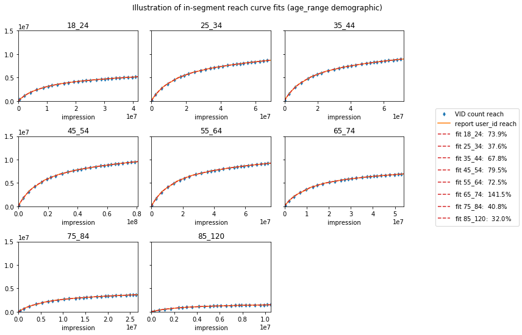
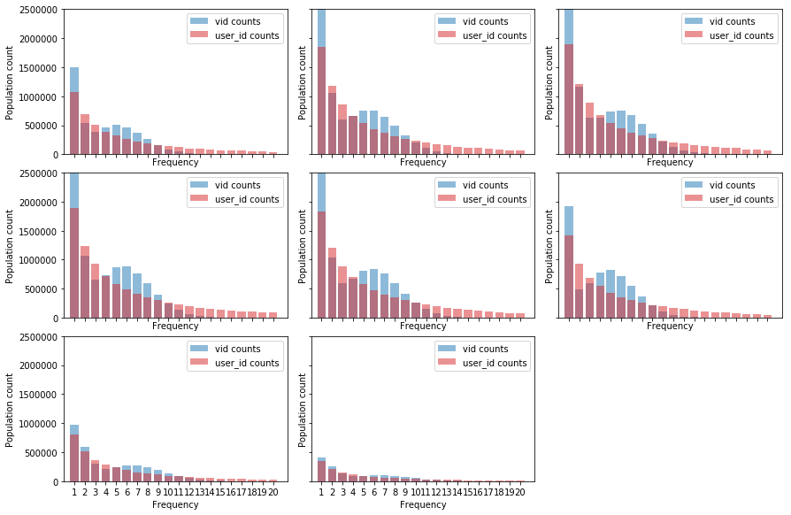

# Cross Media Virtual ID Research 

We believe every human on the planet should have free access to the world’s information and content. This is powered by a three way value exchange between a media owner publishing free content, a consumer consuming it and an advertiser paying for the chance to connect with the media owner’s audience. The underpinning of this value exchange relies on having an independent auditing, measurement and optimization layer to power the transaction between the advertiser and media owner. Today the industry standard tools for advertising and media measurement and optimization are usually designed where increased personalization, higher advertising return on investment and increased media owner revenues often comes with negative trade off for consumer privacy or security risks of leaking private data. We envision a world where this doesn't have to be the case - a world where consumer privacy, security, and governance are incorporated into the fabric of the codebase while enabling the necessary business use-cases to effectively keep the world’s information and content free for everyone.

This repository currently containes the initial R&D of VideoAmp's data science team on one key concept on this journey toward reinventing privacy from the ground up; Virtual ID (VID) assignment to impressions/events. The VID assignment is a set of algorithms, initially suggested in the paper [Virtual People: Actionable Reach Modeling](https://research.google/pubs/pub48387/). We are going to be initially focused on getting linear TV household data into this model in an accurate way, then extend the household level TV data to the person level and combine it with person level digital data for a true cross-media measurement methodology of household level TV ad exposure and person level digital ad exposure in a unduplicated fashion.

## Code Structure
We assume the existance of the following two tables. The `df_impressions` table containing the impressions/events and the `df_census` table
containing the total number of people in the product of demographics. The input dataframe `df_impressions` is the impression table containing
the following columns:

| Column(s) | Type | Explanation |
| -: | :-: | :-|
|`user_id`        | String       | The user identifier, which is the device_id, cookie_id, etc.
|`device_type`    | String       | The medium through which the impression is created, e.g. TV/Linear, Digital, etc
|`timestamp`      | Timestamp    | The timestamp of the impression/event occurrence.
|`weight`         | Integer      | The weight associated to the user type is integer. The outcome of panel skew correction.
|`geolocation`    | String       | A column representation geolocation, DMA, or zip code, etc
|`demo_cols`      | String(s)    | A set of columns representing the demographics associated to the user
|`extra_cols`     | 0,1 Integer(s)  |A set of columns of extra labels, such as interest, etc, associated to the user

The `df_census` table contains the following columns:
| Column(s) | Type | Explanation |
| -: | :-: | :-|
| `demo_cols`  | String(s) | A set of columns representing the demographics associated to the user |
| `population` | Integer   | The population size corresponding the combinations of the demographics |

The `demo_cols` columns are only used when in-segment reach curve
is desired, for example when the exact reach curve inside each of the segments
such as `age_range`, `ethnicity`, etc is needed.

All the functions, including the VID assignments, reach/frequency calculations, and plottings functionalities are currenlty under the `vid_spark.py` file.

### Notebooks
Table of available notebooks and a brief description of their content.
| Notebook | Description |
| :-: | :- |
| [VID_uniform_reach](https://github.com/VideoAmp/privacyAmp/blob/master/VID_uniform_reach.ipynb) | Detailed notebook about the issues with assuming uniform reach and comparison with the alternative, in-segment learning of reach curves. |
| [VID_basic_count](https://github.com/VideoAmp/privacyAmp/blob/master/VID_basic_count.ipynb) | The basic VID assignment example. Here we also explain why we have to use a unique impression identifier to assign VIDs. |
| [VID_basic_explode](https://github.com/VideoAmp/privacyAmp/blob/master/VID_basic_explode.ipynb) | The basic VID assignment example where the impressions are exploded based on the associated weight to each user. |

## Road Map
Privacy-preserving measurement is a fast-evolving field. We wish to implement multiple VID assignment strategies that fit different needs and situations. In particular we’d like to follow the roadmap below:

- Provide synthetic data
	- Synthetic impression data generation
	- Provide detailed simulations of the various VID assignment methods developed
- Detail problematic issues regarding TV/linear data and develop practical solutions
	- Address specific time slot for TV shows
	- Design the concept of “cookie” for TV/linear viewership
- Modify the VID assignment algorithm for correct frequency estimation
	- Simulate the long tail TV/linear
	- Explore possible modification of the original VID assignment
- Towards private cross-media measurement
	- Detail the difference of digital cookie and TV/linear device
	- Design cross-media VID assignment algorithms
	- Test/simulate cross-media VID assignment

Here is an in-depth exploration of the issues ahead of our road:  

### Provide synthetic impression records
While we are committed to sharing a sample of our TV/linear viewership data, we understand that accessing the data may not be possible for most people interested in demoing the VID assignment algorithms. As an alternative, we would like to provide easil accessible synthetic data with the desired properties in order to facilitate additional contributions to make this repo useful for those interested. 
 
### Explain and address issues specific to TV/linear viewership records
The methodologies to measure effectiveness of TV/linear ads and digital ads vary significantly.
Unlike digital data, only a fraction of the TV/linear data is available which in turn requires us to extrapolate information from a panel of households to the entire population based on a weighting methodology. Furthermore, TV/linear viewership comes in batches of impressions lacking a specific time ordering (that is hundreds of thousands of impressions for a single ad that airs during a program). Therefore a typical reach curve (as a function of number of impressions) is not as smooth as a digital reach curve.
 
Another important difference is that for digital ads, the reach curve usually indicates the *number of unique people reached* as a function of *unique IDs reached* -- so the problem boils down to the mapping from people to IDs. However, in the TV/linear viewership, the devices are identified by a unique household identifier and therefore, posing different challenges to ID resolution.
 
 A related issue is that TV shows air at specific time slots and are not available at all times unlike most content provided by digital publishers. The timestamp of each impression carries relevant information to viewership patterns and thus it would not be suitable to “smear” out the impressions into a smooth reach curve as is required by basic VID assignment methodologies.
 
The last difference is that co-viewership is very common for linear viewership and addressability is not widespead. A simple approach is to start from viewership and add probabilistic steps in the VID assignment algorithm. The reliability of such approaches are subject to further research, and a more direct measurement may be required for a convincing final measurement report.
        
### Getting the frequency right
We have shown in the notebooks that fitting reach curves to mixtures of deltas does not result in a correct reach/frequency estimation. More precisely, the long algebraic tail of TV/linear viewership does not follow a mixture of delta activity distribution functions. Therefore, more care should be taken to get the frequency estimation right. We believe a small modification to the original suggestion of VID assignment can faithfully predict the frequency for a wide range of exposures. The following plots illustrate the issue with frequency estimation: while the reach curves are correctly estimated the frequencies show an over-population near the positions of the Dirac deltas, and lack the long tail. The data is for in-segment reach curve fittings of a mixture of three delta functions for the age-range demographics.

	
### Towards private cross-media measurement.
Of course the final desired product is a fully functional cross-media measurement VID assignment platform. In order to achieve this goal, we have to combine all the solutions above and research the applicability of the VID algorithm across TV/linear and digital impressions.

